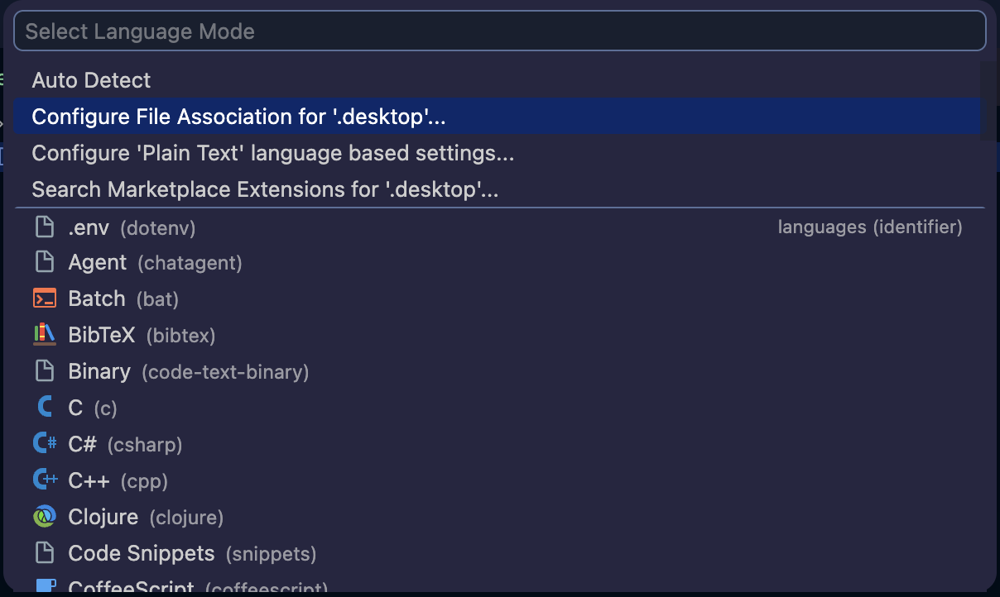

# The basics

Apps for Windows93 can be created on the system itself, using Notepad or any similar text editor, or on your own system.

## VSCode association

Windows93 shortcuts (typically launchers and installers) frequently make use of `.desktop` files. VSCode can be configured to recognize these files correctly.  
1. Open or create a `.desktop` file in VSCode.
2. Click on the language mode indicator in the bottom right corner of the VSCode window (it will say "Plain Text").
3. In the dropdown menu that appears, select "Configure File Association for '.desktop'".

4. Select "INI" from the list of languages.